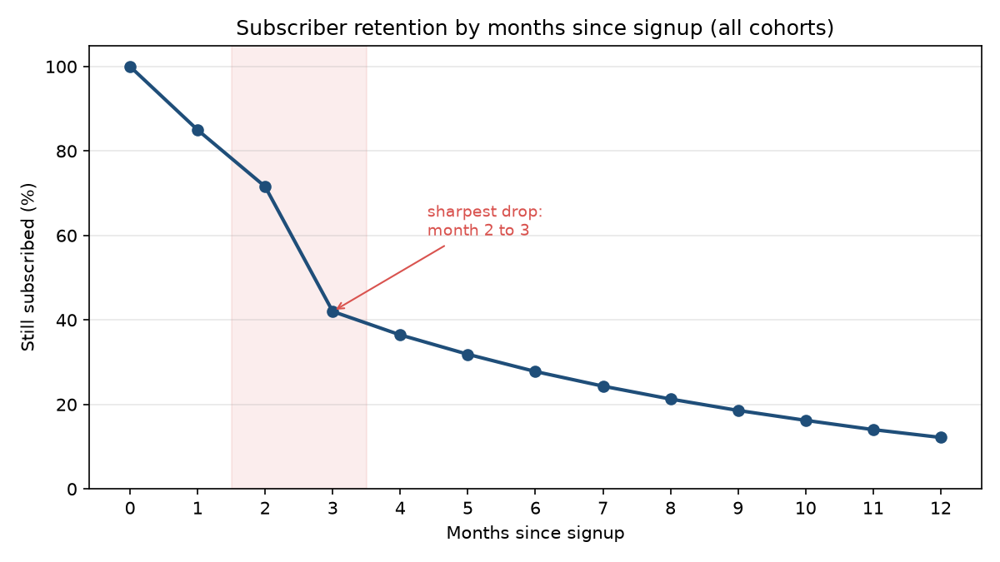
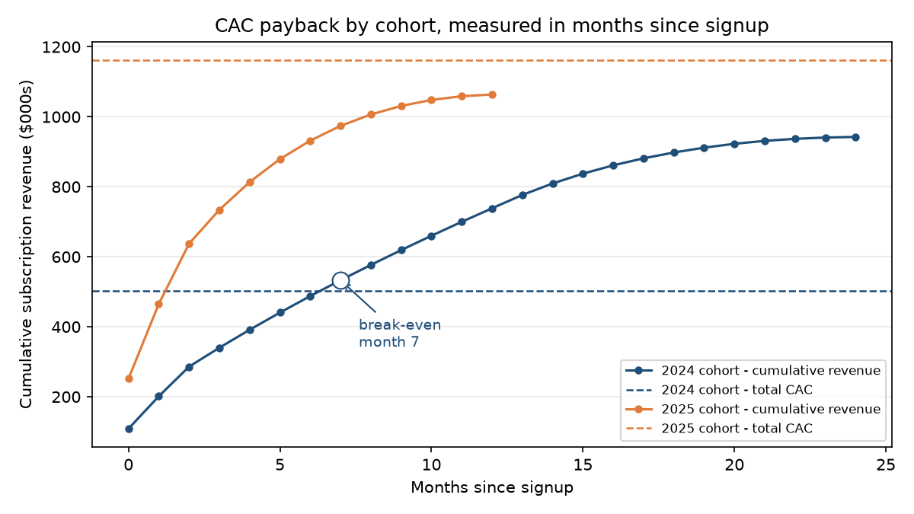

# Fitness Subscription Analytics

Retention, revenue and payback analysis for **FitnessHub**, a subscription fitness platform selling
workout plans, nutrition coaching and on-demand classes. Built in Tableau on 9,300 customers and
64,979 transactions spanning January 2024 to January 2026, with every headline number independently
recomputed in Python.

Three questions from leadership:

1. After how many months do subscribers typically cancel?
2. What does the revenue trend look like, and can it be forecast?
3. How long does each cohort take to earn back its customer acquisition cost?

## Headline numbers

| Metric | Value |
|---|---|
| Customers | 9,300 |
| Transactions | 64,979 (Jan 2024 – Jan 2026) |
| Total revenue | $2,594,959 |
| Total CAC spend | $1,663,996 |
| Average CAC | $178.92 (median $163.90) |
| Median subscriber lifespan | **2 months** |
| Month-3 retention | **42.0%** |
| 2024 cohort CAC payback | **month 7** |
| 2025 cohort CAC payback | **not yet recovered** (see correction below) |
| Peak revenue month | Dec 2025, $275,624 |

## 1. Retention: the cliff is at month 3



Retention erodes gently for two months, then falls off a cliff: **71.6% → 42.0% between month 2 and
month 3**, a 29.5-point single-month drop that is by far the largest in the curve. Median subscriber
lifespan is just 2 months. After month 3 the decline flattens into a normal slow bleed (27.8% at
month 6, 12.2% at month 12).

The shape matters more than the level. A gradual decline would point at product value; a cliff at a
fixed point in the lifecycle points at a **specific trigger** — most likely the end of an
introductory period or the third billing event. Whatever survives month 3 tends to stick around,
which makes months 0–3 the only window where retention spend can move the number.

*Tableau view: `screenshots/cohort_analysis.png`*

## 2. Revenue: strong growth, and a forecast that should be ignored

Revenue grew from $528,892 in 2024 to $1,872,453 in 2025 — a 3.5× increase — peaking at $275,624 in
December 2025. Growth is real and driven by cohort size: the 2025 signup cohort (6,484 customers) is
more than twice the 2024 cohort (2,816).

**The forecast in the Tableau view should not be quoted.** The "steep decline into mid-2026 followed
by partial recovery" is an artefact of exponential smoothing extrapolating from a December peak with
only 25 months of history and a final partial period, not a seasonality finding. With two Decembers
in the data there is no way to separate seasonality from growth. A trustworthy forecast needs at
least three full seasonal cycles, or a bottom-up model built from cohort size × retention curve ×
ARPU instead of a curve fitted to a total.

*Tableau view: `screenshots/revenue_forecast.png`*

## 3. CAC payback: about 7 months, not 12



Measured in **months since signup**, the 2024 cohort recovers its $501,537 acquisition cost at
**month 7**, reaching $942,512 in cumulative revenue by month 24 — roughly 1.9× CAC. The 2025 cohort
is tracking ahead of that pace per month but has only 12 months of observed history and sits at
$1,063,636 against $1,162,459 of CAC, so it has **not** technically crossed break-even yet. That is
censoring, not underperformance: it is on the same trajectory and should cross shortly after the
data ends.

### Correction to an earlier version of this analysis

An earlier version of this README reported that **both** cohorts broke even "around December of their
cohort year," implying a ~12-month payback period. That was wrong, and the coincidence of both
landing in December was the tell. The Tableau CAC vs LTV sheet plots cumulative revenue against a
**calendar** axis while comparing it to a full-cohort CAC total, which mixes customers who signed up
in January with customers who signed up in November and makes the crossing point a function of the
calendar rather than of the customer lifecycle.

Recomputing on a cohort-relative axis — month 0 = each customer's signup month — gives month 7 for
2024. [`analysis/verify_metrics.py`](analysis/verify_metrics.py) reproduces this from the source
workbook and regenerates both corrected charts above. The Tableau sheet is on the list to rebuild.

## Recommendations

1. **Concentrate retention spend in months 0–3.** That single transition holds 30 points of
   retention. Nothing else in the funnel is worth as much.
2. **Diagnose the month-3 trigger before designing the fix.** Confirm whether it lines up with a
   trial expiry, a price step-up or a third charge — the intervention is different in each case.
3. **Use ~7 months as the payback benchmark**, not 12. It changes how aggressively acquisition can be
   funded: at 7 months, faster acquisition is affordable.
4. **Retire the smoothed forecast.** Replace it with a cohort-based projection (cohort size ×
   retention × ARPU), which is defensible with only two years of history.
5. **Segment CAC by channel.** Channel-level CAC exists in the data (7 channels, average $178.92) but
   is not yet cut against retention. Paying above average for a channel that churns at month 3 is the
   most likely hidden waste.

## Data

`data/Fitness_Subscriptions_Dataset.xlsx` — two worksheets:

| Sheet | Rows | Columns |
|---|---|---|
| `customers` | 9,300 | `Customer_ID`, `Subscription_Plan` (Basic/Plus/Premium), `Country` (10), `Acquisition_Channel` (7), `CAC` |
| `transactions` | 64,979 | `Transaction_ID`, `Customer_ID`, `Transaction_Date`, `Revenue`, `Transaction_Type`, `Product` |

**Data note:** the `customers` sheet contains **no signup date**. Cohorts are therefore derived from
each customer's first `Subscription` transaction, which is an assumption, not a given field — a
customer whose first charge failed would be assigned to the wrong cohort. Revenue also spans five
transaction types (Subscription, Fitness Challenge, Nutrition Plan, Personal Training, Annual
Upgrade); retention and payback use subscription charges only, while total revenue includes all five.

## Repository structure

```
fitness-subscription-analytics/
├── README.md
├── report.twbx                      # Tableau workbook: Customer Cohort, Revenue Forecast, CAC vs LTV
├── analysis/
│   └── verify_metrics.py            # Recomputes every number above; regenerates corrected charts
├── data/
│   └── Fitness_Subscriptions_Dataset.xlsx
└── screenshots/
    ├── retention_curve_verified.png # Python, cohort-relative (corrected)
    ├── cac_payback_verified.png     # Python, cohort-relative (corrected)
    ├── cohort_analysis.png          # Tableau
    ├── revenue_forecast.png         # Tableau
    ├── cac_vs_ltv.png               # Tableau (calendar axis - see correction above)
    └── data_model.png               # Tableau relationship between customers and transactions
```

## Reproducing the numbers

```bash
pip install -r requirements.txt
python analysis/verify_metrics.py
```

Prints every metric quoted in this README and rewrites the two verified charts.

## Tech stack

Tableau Desktop · Python (pandas, matplotlib, openpyxl) · Excel

**Methods:** cohort retention analysis · revenue trending · CAC payback / LTV analysis

## License

[MIT](LICENSE)
